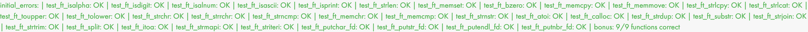

# libft
libft is a 42School project which creates a first C library with convenience functions. Some are reprogrammed libc functions, some our own convenience functions, some linked list functions.  
The project description is in the pdf.

## I passed all tests with 125%


## Usage
This project was written for and compiled on a Mac.  
```
make bonus
```
This yields a file libft.a.  
<br>
Then you have to include the header file in your code
```
#include "libft.h"
```
and link the library
```
gcc -o main main.c -L<path to libft.a> -lft
```

## Caveats
This project was a 42School project, we had to program according to a strict norm, for instance using only while loops, having only 25 lines per function, using no inline comments etc.  
